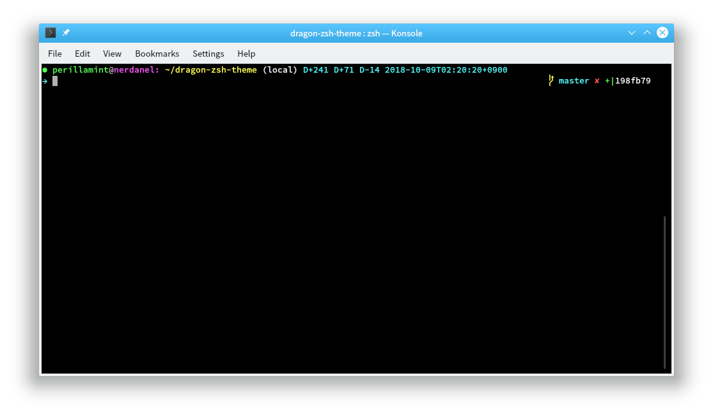

# dragon-zsh-theme

dragon is a minimalistic zsh prompt theme for git users

>sudo apt install zsh
>sudo apt install git
>chsh -s /usr/bin/zsh

(logout)

(login)

0

wget(ohmyzsh)

>sh -c "$(wget -O- <https://raw.githubusercontent.com/ohmyzsh/ohmyzsh/master/tools/install.sh>)"

ohmyzsh 폴더에 dragon-zsh-theme 파일 넣고,

>sudo vi ~/,zshrc

를 편집

>ZSH_THEME="dragon"
>.
>.
>.
>
>&#35; DEFAULT_USER
>
>DEFAULT_USER="abc"

## Feature

*   Pretty prefix prompt signature
*   Pretty color
*   Current directory
*   Time stamp (in ISO 8601 format)
*   D-Day counter (require Node.JS)
*   SSH session indicator
*   Git prompt info
*   Git status info

## License

MIT License Copyright (c) 2017 [sabertazimi](https://github.com/sabertazimi) and [perillamint](https://github.com/perillamint)

## Contact

-   
-   
-   

